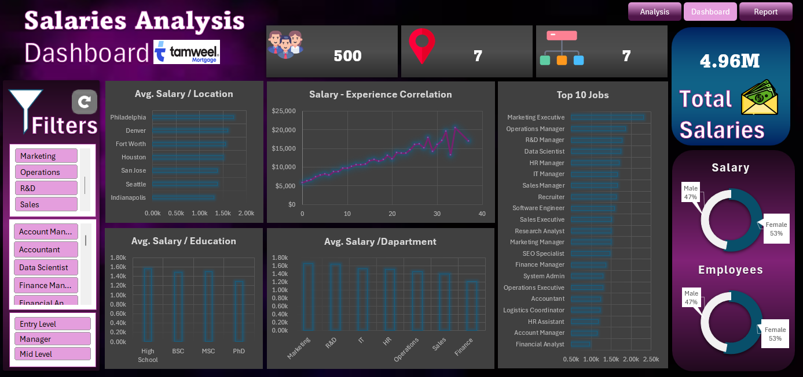

# HR Salaries Analysis – Excel Dashboard

## 📊 Project Overview
This project focuses on analyzing HR salary data to uncover insights related to employee distribution, salary structure, and key influencing factors such as department, gender, education level, and years of experience.

An interactive Excel dashboard was built to support data-driven decision making for HR and management teams.

---

## 🎯 Objectives
- Analyze total salaries and employee distribution  
- Identify salary differences by department and gender  
- Study the relationship between salary and years of experience  
- Highlight top-paid employees  
- Provide clear insights and recommendations for salary structure improvement  

---

## 🛠 Tools & Technologies
- *Microsoft Excel*
  - Pivot Tables
  - Power Query
  - Power Pivot
  - Excel Dashboards
  - VBA Macros (for automation)
- *Data Cleaning & Transformation*
- *Data Visualization*

---

## 📈 Dashboard Features
- Total salaries overview  
- Employee count, departments, and locations summary  
- Average salary by department  
- Average salary by gender  
- Salary distribution by gender  
- Salary vs. years of experience analysis  
- Top 10 employees by salary  
- Final report with actionable recommendations  

---

## 📷 Dashboard Preview

---

## 🎥 Demo Video
A short demo video showcasing the dashboard and its interactivity:  
*HR_Salaries_Analysis_Dashboard_Demo.mp4*

---

## 📝 Key Insights & Recommendations
- There is a clear inconsistency in salary distribution based on academic degree and certificate level.  
- Salary structures should be reviewed across all job grades and most departments.  
- It is recommended to standardize salary structures across company branches.  
- Years of experience have a strong impact on average salary and are administratively valid.  
- Other factors should also be considered to ensure fair compensation.
